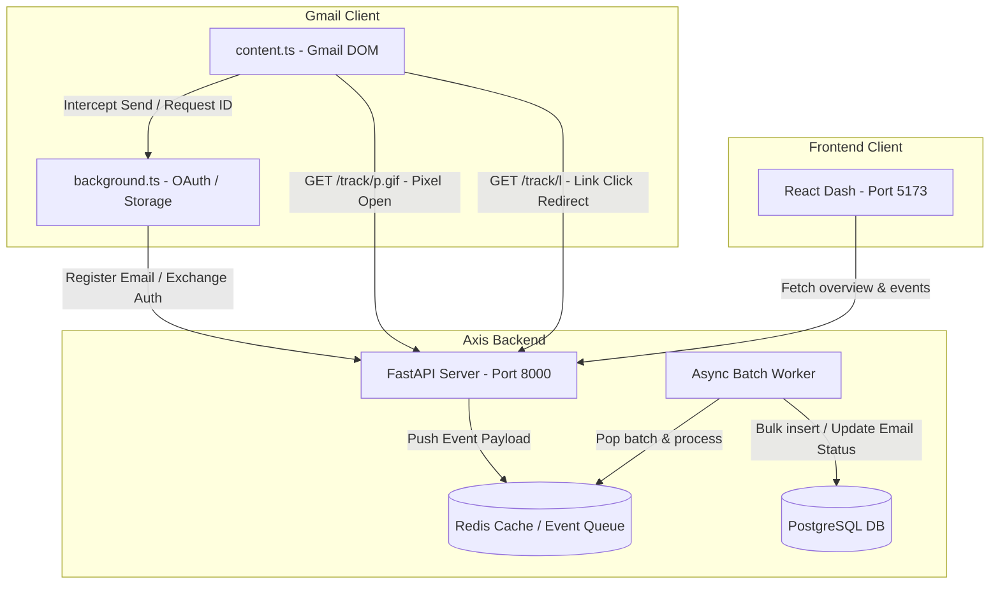

# AXIS TRACKER // REAL-TIME EMAIL TELEMETRY

Axis Tracker is an enterprise-grade, privacy-first email tracking ecosystem. It integrates a Manifest V3 browser extension for Gmail compose window interception, a high-performance FastAPI backend leveraging Redis sliding-window rate limiting, an asynchronous queue-based batch database writer, and a developer-focused brutalist React dashboard panel.

---

## 1. ECOSYSTEM ARCHITECTURE



---

## 2. DIRECTORY STRUCTURE

* `backend/`
  * `app/`
    * `core/`: Config settings, database connection, JWT/API Key authentication, and custom CORS/rate limiter middleware.
    * `models/`: SQLAlchemy 2.0 async database models (users, tracked emails, tracking events).
    * `schemas/`: Pydantic v2 schemas for request validation and response formatting.
    * `services/`: Bot detection patterns and background queue worker.
    * `routers/`: API endpoints for tracking pixel, link redirect, auth, and email CRUD.
    * `main.py`: FastAPI entry point.
  * `requirements.txt`: Python package requirements.
  * `Dockerfile`: Multi-stage Docker build config.
* `extension/`
  * `manifest.json`: Chrome extension Manifest V3 file.
  * `background.ts`: Identity API token generator and API key register.
  * `content.ts`: Gmail compose MutationObserver, button toggle UI, send interceptor, link rewriter, and pixel injector.
  * `package.json` & `tsconfig.json`: Extension build environment.
  * `build.js`: Fast TypeScript bundler script using `esbuild`.
* `frontend/`
  * `src/`: React source code (components, store, main styling).
  * `tailwind.config.js` & `postcss.config.js`: Tailwind styling configuration.
  * `package.json` & `vite.config.ts`: Vite development settings.

---

## 3. HOW TO RUN

### Step 3.1: Start the Backend (API, Worker, Postgres, Redis)
Navigate to the root directory and boot up the containers using Docker Compose:
```bash
docker-compose up --build
```
* **FastAPI Server:** Runs at `http://localhost:8000`. You can access automated interactive docs at `http://localhost:8000/docs`.
* **Postgres Database:** Exposes port `5432` locally. Tables are automatically initialized on server start.
* **Redis Cache:** Exposes port `6379` locally.

### Step 3.2: Compile and Install the Chrome Extension
1. Open a terminal inside the `/extension` directory and install dependencies:
   ```bash
   cd extension
   npm install
   ```
2. Build/compile the TS files:
   ```bash
   npm run build
   ```
3. Open Google Chrome and navigate to `chrome://extensions/`.
4. Enable **Developer Mode** (toggle in the top-right corner).
5. Click **Load unpacked** in the top-left and select the `/extension` directory.
6. The extension is now active on `mail.google.com` compose views.

### Step 3.3: Run the React Dashboard
1. Open a terminal inside the `/frontend` directory and install packages:
   ```bash
   cd frontend
   npm install
   ```
2. Launch the Vite local dev server:
   ```bash
   npm run dev
   ```
3. Open `http://localhost:5173` to access the console panel.
4. Input an email address to register/log in. The dashboard will automatically pull data from the API and refresh every 10 seconds.
